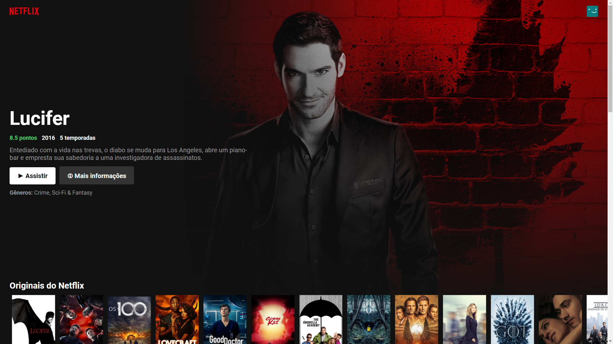

# netflix-clone
A clone of the Netflix interface developed in react. 🍿📺
If you clone this app, to run you need to change the tmdb API´s key.

### Available Scripts 💻

**Cloning repository and running**

```bash
$ git clone https://github.com/Vitorrrocha/netflix-clone && cd netflix-clone
```

**Installing dependencies**

```bash
$ yarn
```

**Getting Started**

```bash
$ yarn start
```
